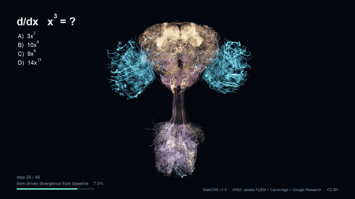
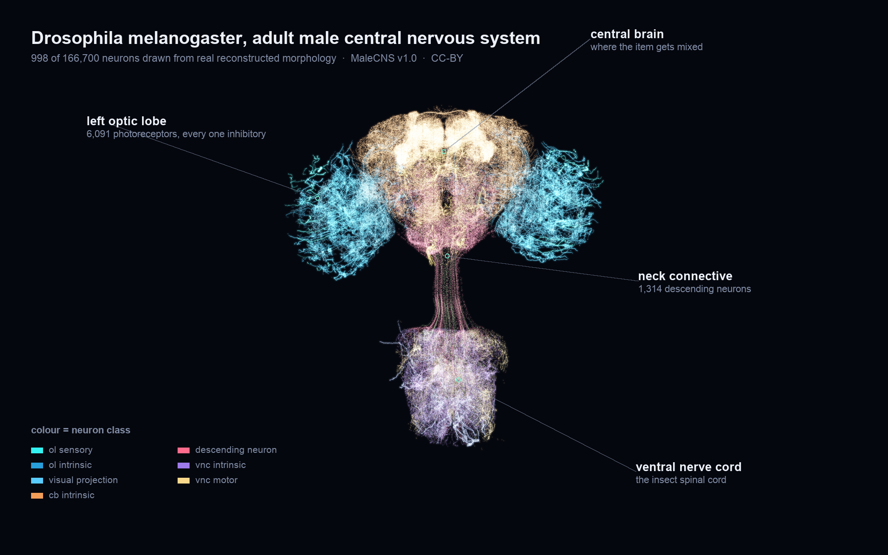
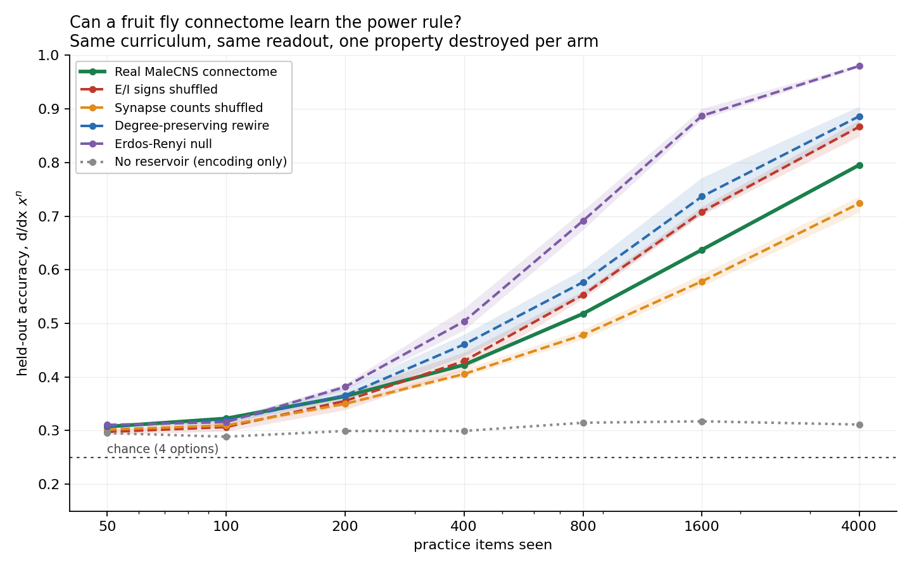

# Can a fruit fly connectome learn the power rule?

A real fruit fly brain, answering a calculus question it has never seen.



*Every strand is a real reconstructed neuron from the published connectome. The
glow is real simulated activity: the item-driven difference against a
blank-input baseline. The answer and confidence on screen are the model's actual
output on a held-out item.*
[Full 24s film (webm)](out/flybrain_calculus_1280.webm)

---

A control experiment on the HHMI Janelia / Google Research **MaleCNS v1.0**
connectome (CC-BY). The fly is given a multiple-choice calculus item,
`d/dx x^n`, and we measure whether the wiring it was born with helps it answer.

**Every number below is produced by `experiment.py` and written by `report.py`.
Nothing is hand-typed.**

## Headline

The fly learns the task: **0.795** held-out accuracy against a
**0.311** control and 0.25 chance, with a clean
learning curve over practice items.

**And the real wiring is not why.** The arms come out in a clean ordering, and
it runs the wrong way: **the more biological structure you destroy, the better
the fly does.** Permuting which neurons are excitatory or inhibitory beats the
real graph. Rewiring it at random while keeping each neuron's degree beats that.
A plain Erdos-Renyi random graph with nothing but the right edge count and
weight distribution scores 0.980 - close to ceiling, and
+0.185 over the animal's own connectome.

The one manipulation that *hurt* was shuffling synapse counts across edges
(0.723), which changes each neuron's total input
drive and so moves the network out of its operating regime. That is a dynamics
effect, not an information one.

The honest reading: at this scale the connectome is acting as a **random
nonlinear reservoir**. Its size and sparsity hand a linear readout a rich
feature space, which is why the fly beats the control at all. Its actual
biological structure contributes nothing to this task and measurably constrains
it - which is unsurprising. A fly brain is organised for fly problems, and that
organisation costs it the generic mixing a random graph gives for free.

Anyone reporting that a connectome-driven agent succeeded at a task, without
running these arms, has not shown that the connectome did anything.

## What you are looking at



998 of the 166,700 neurons, drawn from the reconstructed morphology that ships
with the dataset. Both optic lobes, the central brain, the neck connective and
the ventral nerve cord are where they are because that is where those cells
actually go.

## Visuals

| | |
|---|---|
| `out/flybrain_calculus.gif` | the loop above, for embedding anywhere |
| `out/flybrain_calculus_1280.webm` | 24s film: the fly answering a held-out item, real morphology, real activity |
| `out/anatomy.png` | labelled anatomy figure with colour key (above) |
| `out/mastery_curves.png` | the six-arm result |
| `out/poster.png` | still frame for thumbnails |
| `out/angles.png` | camera-angle contact sheet used to pick the view |

Higher-bitrate 1080p and square cuts are produced by `encode.sh` from the
rendered frames; only the small webm is committed, to keep the repo clonable.

The film draws 998 real reconstructed neurons (SWC skeletons from the dataset,
656k points) under a slow camera sweep, with per-neuron brightness driven by the
**item-driven difference** in spiking against a blank-input baseline. Raw firing
saturates near 18% and renders as an undifferentiated blob; the difference is
both the meaningful quantity and the one that actually shows a wave.

The item on screen is held out of the readout's training set and the on-screen
answer and confidence are the model's real output, not a caption. `pick_film_item.py`
chooses it; an earlier cut filmed a training-set item, where accuracy is 1.000
and being right means nothing.

## Results

4-way multiple choice, chance = 0.250. 4000 training items,
1500 held out, readout = 8000 neurons.

| Arm | Held-out accuracy | Spread (seeds) | n | vs real |
|---|---|---|---|---|
| Real MaleCNS connectome | 0.795 | - | 1 | +0.000 |
| E/I signs shuffled | 0.866 | +/- 0.012 | 3 | +0.071 |
| Synapse counts shuffled | 0.723 | +/- 0.012 | 3 | -0.072 |
| Degree-preserving rewire | 0.886 | +/- 0.016 | 3 | +0.091 |
| Erdos-Renyi null | 0.980 | +/- 0.002 | 3 | +0.185 |
| No reservoir (encoding only) | 0.311 | - | 1 | -0.484 |

### Learning curve (held-out accuracy vs practice items seen)

| Items seen | 50 | 100 | 200 | 400 | 800 | 1600 | 4000 |
|---|---|---|---|---|---|---|---|
| Real connectome | 0.307 | 0.323 | 0.364 | 0.423 | 0.518 | 0.637 | 0.795 |
| No reservoir | 0.295 | 0.289 | 0.299 | 0.299 | 0.315 | 0.317 | 0.311 |



### The readout port matters more than the wiring

Reading from the 1314 **descending
neurons** - the port essentially every viral fly-plays-a-game demo uses -
gives **0.313**, indistinguishable from
having no fly at all. The item information is in the network; descending
neurons just do not carry it.

| Readout neurons | Held-out accuracy |
|---|---|
| 250 | 0.337 |
| 1000 | 0.463 |
| 4000 | 0.715 |
| 8000 | 0.795 |

## What would have gone wrong without controls

Two task bugs were caught by controls, not by inspection. Both would have
produced a confident, wrong, publishable-looking claim:

1. **A topographic encoding leaked.** Position-coded values let a plain linear
   readout do arithmetic on bump positions. It scored 0.718 on its own - the
   reservoir was decorative and the fly contributed nothing.
2. **The item set leaked.** "Pick the option whose exponent is one less than its
   coefficient" scored 0.710 *without reading the question*. The reservoir and
   the control both found that rule and both stopped there, at identical
   accuracy.

`task.audit_shortcuts()` now runs question-blind heuristics on every generated
dataset and `experiment.py` asserts they all sit at chance.

## Method

- **Graph.** MaleCNS v1.0 flat connectome. 3+ synapse threshold
  (standard practice; single- and double-synapse connections are noise-prone).
  Signs from the shipped neurotransmitter predictions: acetylcholine excitatory,
  GABA / glutamate / histamine inhibitory, aminergic treated as modulatory and
  excluded from fast transmission.
- **Dynamics.** Leaky integrate-and-fire, `{'gain': 0.08, 'drive': 20.0, 'bg': 0.35, 'T': 12}`. The connectome is
  frozen; nothing inside it is ever trained.
- **Encoding.** The item is injected into photoreceptors as random sparse codes,
  one per value, shared across slots. A correct answer requires detecting that
  two codes coincide, which a linear map cannot do.
- **Readout.** L2 multinomial logistic regression on spike counts. This is the
  only thing that learns.

### One biological detail that decided the whole build

All 6,091 photoreceptors in MaleCNS are **histaminergic, i.e. inhibitory**.
Driving them from rest produces only negative current downstream (measured
one-hop range: min -703, max exactly 0) and nothing propagates. Real fly
photoreceptors tonically inhibit their targets and light *reduces* that release,
so the model needs a tonic background current for the item to sculpt. Without
it, zero descending neurons ever fire.

## Limitations

- One task, one encoding, one dynamics regime. A different task could rank the
  arms differently.
- The encoder and readout port are engineered, not biological. This measures
  whether connectome structure is a useful inductive bias for an artificial
  task, not whether the fly can do calculus. It cannot.
- The mushroom body learning circuit present in the data (4,064 Kenyon cells,
  97 MBONs, 340 dopaminergic neurons) is **not** used here. Gating plasticity
  on answer feedback is the obvious next experiment.
- Null graphs get 3 seeds; the real graph is by definition n=1.

## Reproduce

```
python3 -m venv .venv && ./.venv/bin/pip install pyarrow numpy scipy matplotlib torch
./.venv/bin/python build_graph.py     # downloads must already be in data/
./.venv/bin/python experiment.py      # ~40 min on an M-series laptop
./.venv/bin/python chart.py && ./.venv/bin/python report.py
```

Data: <https://male-cns.janelia.org/download/> (CC-BY 4.0). Connectome by HHMI
Janelia FlyEM, the Cambridge Drosophila Connectomics Group and Google Research.
The three files `build_graph.py` expects go in `data/`; they total about 1 GB
and are not committed here.

Code in this repository is MIT licensed (`LICENSE`). The connectome data is
not: it is CC-BY 4.0 and must be credited. See `NOTICE`.
